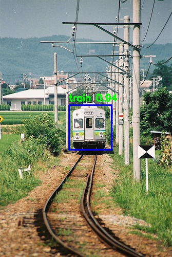
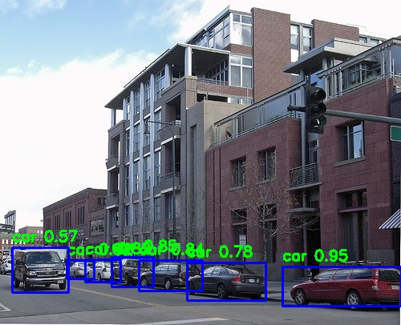
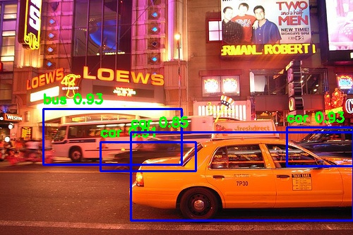
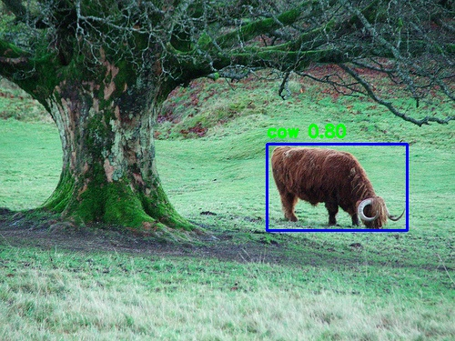

# Yolo-v3-train
train yolo-v3 for your own dataset

### Tips:

1. There are some minor improvements in the code compared to that in my another repo ([v3-tiny](https://github.com/LordkTk/Yolo-v3-tiny-train)), but the functions of the files are the same.

2. During training, i only used warm-up and first-stage for training, i.e., only the detection part of the net was trained, and i didn't enable multi-scale training. I did in this way because the full net is so large that i couldn't train it fully because of my poor computation resource. If permitting you can train the whole net and the performance of the model can be further improved.

### Parameters setting:

I didn't experiment carefully but desirable results can be obtained with following hyperparameters:

--initial learning rate = 1e-4;

--focal loss: alp = 1, gamma = 2;

--epoch_num: warm-up: 5, first-stage: 95.

The model is trained on the VOC 2007+2012 trainval dataset and gets an mAP of 75.81 on the test dataset of VOC 2007. The model's performance can be improved by adjusting parameters carefully, as well as adopting other tricks such as muiti-scale training. Note that data augmentation is very important for good performance.

### Results:

Some of the test results are shown below (with conf_threshold = 0.5 and iou_threshold = 0.5):

The results are much better than those obtained with [v3-tiny](https://github.com/LordkTk/Yolo-v3-tiny-train), though for tiny the whole net was trained.
