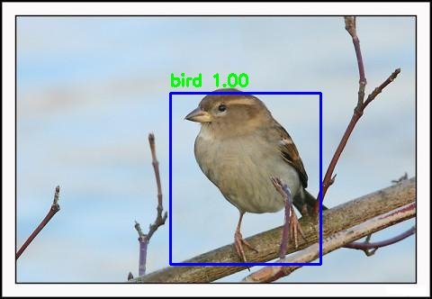
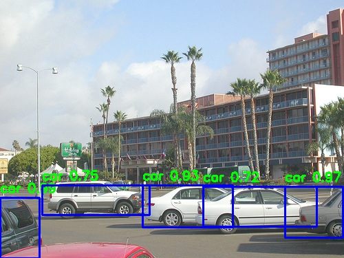
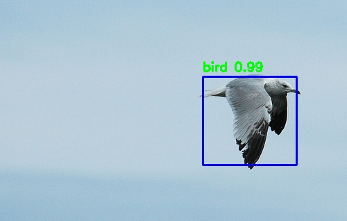
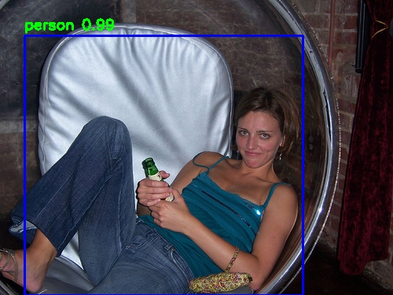
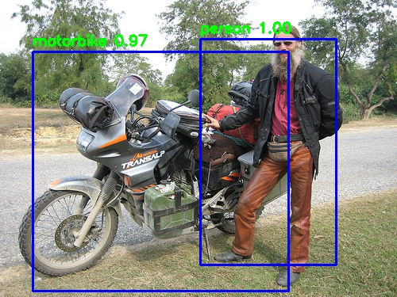

# yolo-v3-train
train yolo-v3 for your own dataset

#Tips:

1. There are some minor improvements in the code compared to that in my another repo ([v3-tiny](https://github.com/LordkTk/Yolo-v3-tiny-train)), but the functions of the files are the same.

2. During training, i only used warm-up and first-stage for training, i.e., only the detection part of the net was trained. I did in this way because the full net is so large that my poor computation resource didn't let me train it fully. If permitting you can train the whole net and the performance of the model can be further improved.

#Parameters setting:

I haven't experimented carefully but desirable results can be obtained with following hyperparameters:

--initial learning rate = 1e-4;

--focal loss: None;

--epoch_num: warm-up: 3, first-stage: 20.

The model gets an mAP of 50.2 on the test dataset of VOC 2012 (i get the test dataset by randomly dividing the full dataset to train and test parts, and the test part has 1000 imgs). The model's performance can be improved by adjusting parameters carefully, as well as adopting muiti-scale training and data augmentation.

Results:

Some of the test results are shown below (with conf_threshold = 0.5 and iou_threshold = 0.5):

The results are much better than those obtained with [v3-tiny](https://github.com/LordkTk/Yolo-v3-tiny-train), though for tiny the whole net was trained.
